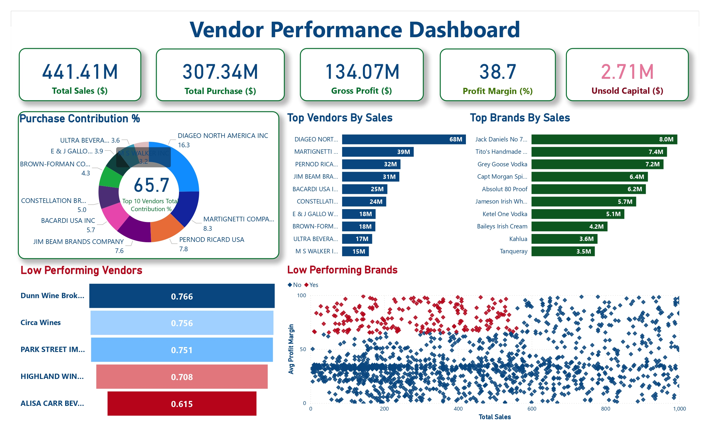

# Vendor Performance Analysis & Dashboard

## Overview

This project analyzes **vendor and brand performance** using sales, purchase, pricing, and inventory data.

The goal is to identify **top-performing vendors**, **low-performing vendors and brands**, and uncover **profitability and inventory insights** through an end-to-end data analytics workflow.

---

## Tools & Technologies

- Python (Pandas, NumPy, SQLAlchemy)
- SQL (CTEs, Joins, Aggregations)
- SQLite / MySQL
- Power BI
- Git & GitHub

---

## Data Pipeline

1. Ingested multiple CSV files using Python and Pandas.
2. Loaded and combined data into a database.
3. Performed data cleaning and transformation using Python and SQL.
4. Created business metrics including:
   - Gross Profit
   - Profit Margin
   - Stock Turnover
   - Sales-to-Purchase Ratio
   - Unsold Capital
5. Analyzed vendor and brand performance using SQL and Python.
6. Built an interactive Power BI dashboard to visualize KPIs and business insights.

---

## Dashboard



### Key Insights

- The top 10 vendors contribute **65.7% of total purchase value**, indicating significant vendor dependency.
- Total sales reached approximately **$441.41M**, compared with **$307.34M** in total purchases.
- Gross profit was approximately **$134.07M**, resulting in an overall profit margin of **38.7%**.
- Unsold capital was approximately **$2.71M**, highlighting opportunities for better inventory planning.
- Vendor and brand performance varies significantly, helping identify both high-performing and low-performing segments.

---

## Metrics Analyzed

- Total Sales
- Total Purchases
- Gross Profit
- Profit Margin
- Unsold Capital
- Vendor Purchase Contribution
- Top Vendors by Sales
- Top Brands by Sales
- Low-Performing Vendors
- Low-Performing Brands
- Inventory Performance

---

## Project Structure

```text
Vendor-Performance-Analysis/
│
├── Dashboard/
│   ├── vendor_performance.jpg
│   └── vendor_performance.pbix
│
├── Notebooks/
│   ├── Exploratory Data Analysis.ipynb
│   └── Vendor Performance Analysis.ipynb
│
├── Scripts/
│   ├── get_vendor_summary.py
│   └── ingestion_db.py
│
├── data/
│   ├── begin_inventory.csv
│   ├── end_inventory.csv
│   ├── purchase_prices.csv
│   ├── vendor_invoice.csv
│   └── vendor_sales_summary.csv
│
└── README.md

